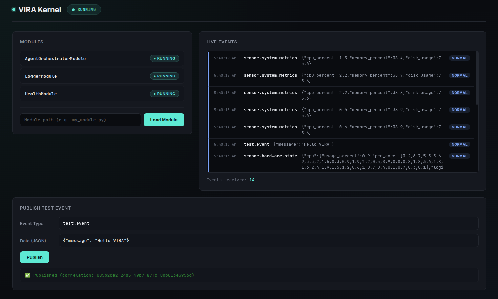

<div align="center">

# VIRA

### An AI-OS / Agentic OS layer for your machine

[](#license)
[](#development-status)
[](#platform-support)
[](#privacy-first)
[](#contributing)

*No cloud. No telemetry. Nothing leaves your machine.*

</div>

---

## Table of Contents

- [What is VIRA?](#what-is-vira)
- [Quick Start](#quick-start)
- [Why it exists](#why-it-exists)
- [Core Principles](#core-principles)
- [How it works](#how-it-works)
- [Architecture](#architecture)
- [Project Structure](#project-structure)
- [Development Status](#development-status)
- [Roadmap](#roadmap)
- [Contributing](#contributing)
- [How VIRA differs from Claude Code, Codex & Copilot](#how-vira-differs-from-claude-code-codex--copilot)
- [License](#license)

---

## What is VIRA?

VIRA is an open-source **AI-OS layer** — also described as an Agentic OS layer — that provides the necessary architecture to:

- Build and maintain **live Context** that models both your system state and your behaviour over time
- **Automatically synthesize** new system apps, tools, and agents from natural language using a verification-based programming language and a provided Domain Specific Language (DSL)
- **Verify correctness** of generated tools before they ever run — not "here's some code, good luck", but something you can actually trust

Everything runs **100% locally**. Nothing is sent to the cloud.

VIRA is built for everyone: general-purpose users who want tools that just work, developers who want a context-rich foundation to build on, and open-source contributors who want to extend and improve the framework.

<!-- add image -->

---
# Quick Start

VIRA can be run either **natively** (recommended for development) or using **Docker** (recommended for isolated environments).

---

## Prerequisites

Before getting started, ensure the following software is installed:

- Python **3.11**
- Git
- Pip
- UV or Conda
- Docker *(only for Docker installation)*
- Ollama *(required for local LLM inference)*

---

# Option 1: Native Installation (Recommended)

### 1. Clone the Repository

```bash
git clone https://github.com/Vishalsng112/VIRA.git
cd VIRA
```

### 2. Create a Python Environment

Choose **one** of the following options.

**Using Conda**

```bash
conda create -n vira python=3.11 -y
conda activate vira
```

**Using UV**

```bash
uv venv --python 3.11

# Linux/macOS
source .venv/bin/activate

# Windows
.venv\Scripts\activate
```

### 3. Install Dependencies

```bash
python -m pip install --upgrade pip
pip install -r requirements.txt
```

### 4. Start Ollama

Ensure the Ollama service is running before launching VIRA.

### 5. Launch VIRA

```bash
python run.py
```

Once the server starts, open:

```
http://localhost:8000
```

---

# Option 2: Docker Installation

### 1. Clone the Repository

```bash
git clone https://github.com/Vishalsng112/VIRA.git
cd VIRA
```

### 2. Build the Docker Image

```bash
bash docker_build.sh
```

### 3. Start the Container

```bash
bash docker_run.sh
```

### 4. Launch VIRA

Inside the running container:

```bash
python run.py
```

The dashboard will be available at:

```
http://localhost:8000
```

---

## Verify the Installation

After launching VIRA, open your browser and navigate to:

```
http://localhost:8000
```

If the dashboard loads successfully, the installation has completed successfully.

---
## Why it exists

Every AI tool you use today starts blind. It doesn't know what you're working on, what's running on your system, how you work, or what you need. You re-explain your own computer to it every single time — and it forgets everything the moment the session ends.

VIRA exists to fix that at the root. It runs as a continuously-updating kernel, senses your environment and your behaviour, and turns that into structured, AI-ready context. The longer-term goal is a system where you describe what you want in plain language and VIRA generates and verifies the right tool to get it done — for everyone, not just developers.

---

## Core Principles

| Principle | What it means |
|---|---|
| Privacy-first | No telemetry, no cloud calls. Everything stays on your device. |
| Open source | MIT licensed — free to study, fork, and build on. |
| Context as infrastructure | Context isn't bolted onto an AI model as an afterthought — it's the core data structure the kernel is built around. |
| User-aware, not just machine-aware | VIRA models how *you* use your system — your workflow, rhythms, and intent — not just what's running on the hardware. |
| Trust through verification | Generated tools will have their correctness checked before you run them. You shouldn't have to hope the AI got it right. |

---

## How it works

VIRA is built around focused **sensors**, each watching one part of your system. Observations flow through a shared **event bus** into a context engine that builds a unified, constantly-updating model of your machine and behaviour.

| Sensor | What it watches |
|---|---|
| System | CPU, memory, load, OS state |
| Hardware | Hardware metrics and resource usage |
| Process | Running processes and their lifecycle |
| Network | Network activity and connectivity |
| Application | Which apps are active and what they're doing |
| Workspace | File system and workspace changes |
| Project | Project structure and metadata |
| Activity | User behaviour patterns and workflow rhythms |
| Context | Aggregates everything into higher-level context |

The architecture is intentionally modular and follows microservice principles — individual components can be optimized, rewritten, or extended without touching the rest of the system.

---

## Architecture

For a full technical breakdown of the framework — subsystems, event schemas, agent spec, sensor spec, memory schema, workflow schema, and config reference — see the framework documentation:

> 📖 **[VIRA Framework Documentation →](./docs/VIRA_DOCS.md)**

The documentation covers:
- Full architecture diagram (all layers: Kernel, Event Bus, Agent Orchestration, LLM, Memory, Tools)
- Canonical event format and naming convention
- How to write an agent (`BaseAgent` interface + full example)
- How to write a sensor (`BaseSensor` interface + full example)
- Memory types and schemas
- Workflow DAG schema and example
- Complete `config.yaml` reference
- LLM provider configuration (Ollama, OpenAI, Anthropic)
---

## Project Structure

```
├── config.yaml
├── docs/
│   ├── VIRA_DOCS.md          ← Framework documentation & schemas
│   └── VIRA_architecture.svg ← Architecture diagram
├── CONTRIBUTING.md           ← Contribution guide
├── requirements.txt
├── run.py
└── vira/
    ├── kernel/               ← EventBus, Dispatcher, Kernel, StateManager …
    ├── sensors/              ← System, hardware, filesystem, user-activity sensors
    ├── agent/                ← BaseAgent, AgentMailbox, examples/
    ├── agent_orchestration/  ← AgentManager, Registry, Router, WorkflowEngine
    ├── agent_runtime/        ← AgentRuntime (bridges agent ↔ LLM/memory/tools)
    ├── llm/                  ← LLMManager + Ollama/OpenAI/Anthropic adapters
    ├── memory/               ← MemoryManager + MemoryEntry schema
    ├── tools/                ← ToolExecutor, ToolRegistry, MCP server
    ├── modules/core/         ← Built-in kernel modules
    ├── plugins/              ← Drop-in plugin directory
    ├── api/                  ← FastAPI app
    └── auth/                 ← Session auth
```

---

## Development Status

**Current phase: maturing the kernel.**

The core kernel — event bus, sensors, context engine, agent orchestration, and kernel APIs — is implemented and working end-to-end. The focus right now is stabilizing and hardening this foundation before moving to the next layer.

- Event bus architecture — functional
- Sensor framework — functional, all sensors implemented
- Context aggregation — functional
- Agent orchestration and runtime — functional
- First event-driven agent — implemented as an end-to-end validation harness
- Most sensors currently use periodic polling (event-driven sensing comes next)
- Linux (X11) is the only supported platform for now

Once the kernel is solid, work will begin on the infrastructure for building agents, the DSL, and integration of a verification-based language (Dafny) so users can generate any app, tool, or agent they need from natural language — backed by strong reasoning models.

**On the implementation language:** the project is currently written entirely in Python. Core parts will later be rewritten in Rust — system-level components in Rust, exposed to the rest of the framework as Python modules. This keeps the contribution surface accessible while allowing the kernel and runtime to be progressively optimized without disrupting the broader codebase.

---

## Roadmap

### Iteration 1 — Functional Kernel *(mostly complete)*

Build a complete, stable kernel that can sense, aggregate, and manage context.

- Sensor framework, event bus, context engine, state management, local AI integration, kernel APIs
- First event-driven agent built on top as a validation harness

### Iteration 2 — Behaviour Awareness and Production Readiness

- Behaviour modelling — move from machine state to user patterns
- MCP-native exposure — expose context as an MCP server so any compatible host or agent can connect
- Event-driven sensing — replace polling with OS-level events
- Security and transparency layer — permission model, local dashboard
- Runtime optimization — lower memory/CPU footprint, better concurrency

**Cross-platform support** is a key goal here. VIRA is currently developed on Linux (X11). The plan is to support Linux (wayland), Windows, and macOS as well.

The chosen approach: VIRA will run as a container with the necessary privileges granted. This works cleanly across platforms because Windows has WSL2 and macOS now ships its own lightweight container tooling. Rather than maintaining separate native ports, a well-configured container gives users on all three platforms the same experience with minimal friction. Platform-specific container setup instructions will be provided for each target OS.

### Iteration 3 — On-Demand Tool Generation

Once the kernel and trust layer are solid, this is where VIRA becomes useful for everyone.

- Intent understanding — parse natural language into structured goals
- Agent and tool synthesis — generate the right agent, script, or mini-app using the kernel's knowledge of your machine and habits, via the DSL and Dafny-based verification
- Verification layer — formal checks that generated tools do what they claim, and nothing else
- Sensor SDK — versioned interface for third-party sensors (browser, Docker, IDE, cloud CLI)
- Native packaging — `.deb` / `AppImage` for Linux, then others

**At this point, the framework will be ready for developers and open-source contributors to add support for new platforms, build new features, and optimize existing components.** The modular architecture is designed specifically to make this tractable — you shouldn't need to understand the whole system to improve one part of it.

---

## Contributing

**Contributions are now open and welcome.** 🎉

Whether you want to build a new agent, add a sensor, fix a bug, improve documentation, or suggest a feature — there's a place for you here. VIRA's modular architecture means you can contribute to one layer without needing to understand the whole system.

> 🤝 **[Read CONTRIBUTING.md →](./CONTRIBUTING.md)**

The contribution guide covers:
- Local dev setup (5-minute quickstart)
- How to write and register a new agent
- How to write and register a new sensor
- Event naming conventions every contributor must follow
- PR checklist

**Good first issues are labelled [`good first issue`](https://github.com/Vishalsng112/VIRA/issues?q=is%3Aissue+is%3Aopen+label%3A%22good+first+issue%22) on GitHub.** If you're unsure where to start, open an issue with the `question` label and describe what you'd like to work on — happy to point you in the right direction.

---

## License

Released under the **MIT License**. See [LICENSE](./LICENSE) for details.

---
