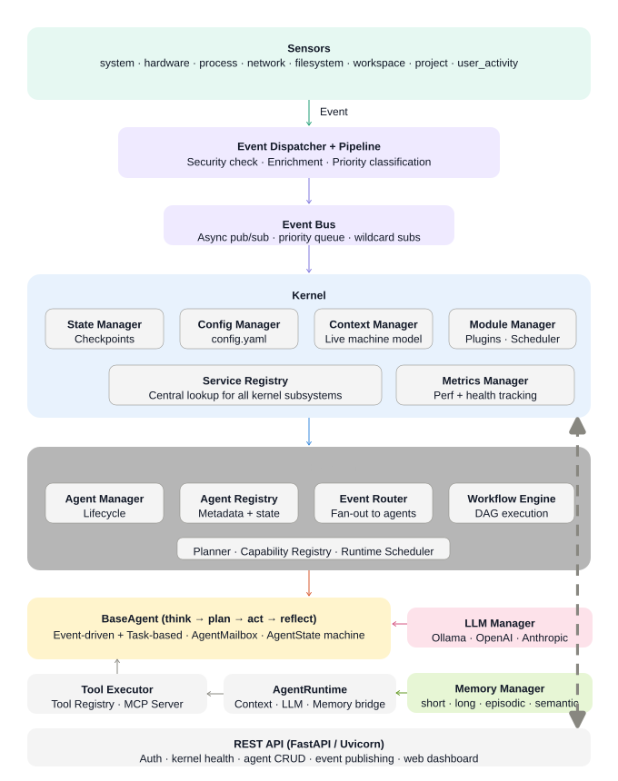

# VIRA Framework — Developer Documentation

> **V**irtual **I**ntelligent **R**untime **A**gent framework  
> An async, event-driven AI kernel for building context-aware autonomous agents.

---

## Table of Contents

1. [Architecture Overview](#architecture-overview)
2. [Boot Sequence](#boot-sequence)
3. [Event Standard (Kernel Events)](#event-standard-kernel-events)
4. [Agent Events](#agent-events)
5. [Agent Specification](#agent-specification)
6. [Sensor Specification](#sensor-specification)
7. [Memory Schema](#memory-schema)
8. [Workflow Schema](#workflow-schema)
9. [Config Reference](#config-reference)
10. [LLM Providers](#llm-providers)

---

## Architecture Overview



---

## Boot Sequence

When `python run.py` is executed, the kernel boots in this exact order:

| Step | State | What happens |
|------|-------|--------------|
| 1 | `LOADING_CONFIG` | `ConfigManager` reads `config.yaml` |
| 2 | `STARTING_EVENT_BUS` | `EventBus` async queue initialised |
| 3 | `SERVICE_REGISTRY` | Core services registered by name |
| 4 | `STARTING_STATE_MANAGER` | Checkpoint directory prepared |
| 5 | `STARTING_SCHEDULER` | Tick loop started |
| 6 | `LOADING_CORE_MODULES` | Modules in `vira/modules/core/` loaded and started |
| 7 | `LOADING_PLUGINS` | Plugin directory scanned |
| 8 | `STARTING_SENSORS` | Enabled sensors in `config.yaml` instantiated and started |
| 9 | `RUNNING` | `kernel.ready` event published; API server starts |

---

## Event Standard (Kernel Events)

All events in VIRA share a single structure, defined in `vira/kernel/event_bus.py`.

### Event dataclass

```python
@dataclass
class Event:
    type: str                          # dot-namespaced string, e.g. "sensor.hardware.state"
    data: Any                          # dict payload — structure depends on event type
    source: str = "kernel"             # component that created the event
    priority: EventPriority = NORMAL   # LOW | NORMAL | HIGH | CRITICAL
    correlation_id: str = uuid4()      # links related events across the system
    timestamp: float = time.time()     # Unix timestamp (seconds)
    verified: bool = False             # set True by EventDispatcher on security pass
```

### Event naming convention

Events follow a **`domain.entity.action`** pattern:

| Namespace | Examples | Emitted by |
|-----------|----------|------------|
| `sensor.*` | `sensor.hardware.state`, `sensor.system.state` | Sensors |
| `kernel.*` | `kernel.ready`, `kernel.shutdown` | Kernel |
| `agent.*` | `agent.registered`, `agent.unregistered` | AgentManager |
| `user.*` | `user.message`, `user.activity` | User-activity sensor / API |
| `fs.*` | `fs.file.created`, `fs.file.modified`, `fs.file.deleted` | FileSystemSensor |
| `workflow.*` | `workflow.started`, `workflow.completed`, `workflow.failed` | WorkflowEngine |
| `memory.*` | `memory.stored`, `memory.retrieved` | MemoryManager |
| `tool.*` | `tool.invoked`, `tool.result` | ToolExecutor |

### Priority levels

| `EventPriority` | Value | When to use |
|----------------|-------|-------------|
| `LOW` | 0 | Background metrics, periodic logs |
| `NORMAL` | 1 | Default for all sensor readings |
| `HIGH` | 2 | User-triggered actions |
| `CRITICAL` | 3 | Security violations, kernel errors, OOM signals |

### Publishing an event

```python
# Via EventDispatcher (recommended — applies security + pipeline)
await dispatcher.publish(Event(
    type="user.message",
    data={"text": "Hello", "session_id": "abc123"},
    source="api",
    priority=EventPriority.HIGH
))

# Convenience dict form
await dispatcher.publish_dict("sensor.cpu.spike", {"cpu_pct": 92.4}, source="system_sensor")
```

### Subscribing to events

```python
# Subscribe to a specific event type
event_bus.subscribe("sensor.hardware.state", my_async_callback)

# Subscribe to all events (wildcard)
event_bus.subscribe_all(debug_logger)
```

---

## Agent Events

Defined in `vira/agent_orchestration/events.py`. These Pydantic models are used for inter-agent and orchestration-level signalling.

### AgentEvent

```python
class AgentEvent(BaseModel):
    agent_id: str        # UUID of the source agent
    event_type: str      # mirrors kernel event type namespace
    data: Dict           # arbitrary payload
```

### TaskEvent

```python
class TaskEvent(BaseModel):
    task_id: str                    # UUID
    workflow_id: str                # UUID of the parent workflow
    step_id: str                    # ID of the workflow step
    status: str                     # "pending" | "running" | "completed" | "failed" | "cancelled"
    result: Optional[Any] = None    # step output on success
    error: Optional[str] = None     # error message on failure
```

### MemoryEvent

```python
class MemoryEvent(BaseModel):
    operation: str                    # "store" | "retrieve" | "delete"
    agent_id: str                     # which agent performed the operation
    memory_id: Optional[str] = None   # UUID of the memory entry
    content: Optional[str] = None     # stored/retrieved text
```

### AgentMessage (inter-agent messaging via AgentMailbox)

Defined in `vira/agent/messaging.py`:

```python
class AgentMessage(BaseModel):
    id: str                           # UUID
    from_agent: str                   # sender agent_id
    to_agent: str                     # recipient agent_id
    content: Dict[str, Any]           # arbitrary payload
    timestamp: datetime
    correlation_id: Optional[str]     # links to the triggering Event.correlation_id
```

---

## Agent Specification

Agents are classes that extend `BaseAgent` (`vira/agent/base.py`).

### Required interface

```python
class MyAgent(BaseAgent):
    def __init__(self, runtime: AgentRuntime):
        super().__init__(
            name="MyAgent",
            description="What this agent does in one sentence.",
            runtime=runtime
        )
        # Declare capabilities
        self._capabilities = [
            AgentCapability(
                name="do_something",
                description="Does the thing",
                input_schema={"text": "str"},     # optional JSON schema dict
                output_schema={"result": "str"},
            )
        ]
        # Declare which kernel events this agent handles
        self._subscribed_events = ["user.message", "sensor.hardware.state"]
        # Optional: run on an interval (seconds), set to None for event-only
        self._interval_seconds = None

    # ---- Mandatory abstract methods ----

    async def think(self, context: AgentContext, **kwargs) -> Dict:
        """Analyse context and current event; return intent/thought dict."""
        ...

    async def plan(self, thought: Dict, **kwargs) -> List[Dict]:
        """Convert thought into an ordered list of action dicts."""
        ...

    async def act(self, plan: List[Dict], **kwargs) -> Any:
        """Execute the plan. Call LLM, tools, or external APIs here."""
        ...

    async def reflect(self, result: Any, **kwargs) -> Dict:
        """Evaluate the result. Optionally persist to memory."""
        ...
```

### Agent lifecycle states

```
INITIALIZED → READY → RUNNING → READY
                              ↘ FAILED
                    → WAITING
                    → TERMINATED
```

### Registering an agent in config.yaml

```yaml
agents:
  - name: MyAgent
    module: my_package.my_agent       # Python import path
    class: MyAgent                    # Class name inside the module
    enabled: true
    config:
      some_param: value               # passed as agent.config dict
    subscribed_events:
      - "user.message"
```

### Sending events from inside an agent

```python
await self.send_event(
    event_type="agent.my_agent.result",
    data={"output": result},
    target_agent_ids=None            # None = broadcast; list of IDs = targeted
)
```

---

## Sensor Specification

All sensors extend `BaseSensor` (`vira/sensors/base_sensor.py`).

### Required interface

```python
class MySensor(BaseSensor):
    def __init__(self, interval: float, event_bus: EventBus, dispatcher: EventDispatcher):
        super().__init__(name="my_sensor")
        self._interval = interval
        self._event_bus = event_bus
        self._dispatcher = dispatcher

    async def start(self) -> None:
        """Start the polling loop."""
        self._running = True
        asyncio.create_task(self._poll())

    async def stop(self) -> None:
        self._running = False

    async def read(self):
        """Read raw sensor data. Return a dict."""
        return {"value": 42}

    async def _poll(self):
        while self._running:
            data = await self.read()
            await self._dispatcher.publish(Event(
                type="sensor.my_sensor.state",
                data=data,
                source=self.name
            ))
            await asyncio.sleep(self._interval)
```

### Registering a custom sensor

```python
# In your own code (before kernel.boot())
from vira.kernel.kernel import Kernel

Kernel.register_sensor("my_sensor", lambda cfg, eb, disp, mm: MySensor(
    interval=cfg.get("interval", 5.0),
    event_bus=eb,
    dispatcher=disp
))
```

Then enable it in `config.yaml`:

```yaml
sensors:
  - name: my_sensor
    enabled: true
    interval: 5.0
```

---

## Memory Schema

Defined in `vira/memory/schemas.py`:

```python
class MemoryEntry(BaseModel):
    id: str                            # UUID
    agent_id: str                      # owning agent
    type: str                          # "short_term" | "long_term" | "episodic" | "semantic"
    content: str                       # text content of the memory
    embedding: Optional[List[float]]   # vector embedding for similarity search
    metadata: Dict[str, Any]           # e.g. {"tags": ["task", "result"], "source": "user.message"}
    created_at: datetime
    expires_at: Optional[datetime]     # None = permanent
    importance: float                  # 0.0 – 1.0; used for retrieval ranking
```

### Memory types

| Type | Lifetime | Use case |
|------|----------|----------|
| `short_term` | Minutes–hours | Current task context, recent messages |
| `long_term` | Indefinite | User preferences, learned patterns |
| `episodic` | Indefinite | Records of past events and agent actions |
| `semantic` | Indefinite | Facts, domain knowledge, distilled understanding |

---

## Workflow Schema

Defined in `vira/agent_orchestration/workflow.py`:

```python
class WorkflowStep(BaseModel):
    id: str                            # unique step identifier
    name: str                          # human-readable label
    agent_id: str                      # which registered agent to invoke
    input: Dict[str, Any] = {}         # static input; supports {{ context.key }} and {{ results.step_id }} placeholders
    depends_on: List[str] = []         # step IDs that must complete first (DAG edges)
    retry_policy: Optional[Dict] = None  # {"max_retries": 3, "delay": 1}
    compensation: Optional[str] = None  # step ID to invoke on failure (saga pattern)

class Workflow(BaseModel):
    id: str
    name: str
    steps: List[WorkflowStep]
    status: WorkflowStatus             # pending | running | completed | failed | cancelled
    context: Dict[str, Any] = {}       # shared context across all steps
    created_at: float
    completed_at: Optional[float]
```

### Example workflow

```python
from vira.agent_orchestration.workflow import Workflow, WorkflowStep

wf = Workflow(
    id="wf-001",
    name="file_analysis",
    context={"target_path": "/home/user/docs"},
    steps=[
        WorkflowStep(id="scan", name="Scan files", agent_id="scanner_agent_id"),
        WorkflowStep(
            id="summarize",
            name="Summarise findings",
            agent_id="summarizer_agent_id",
            depends_on=["scan"],
            input={"scan_result": "{{ results.scan }}"}
        ),
    ]
)

await workflow_engine.execute(wf)
```

---

## Config Reference

Full `config.yaml` key reference:

```yaml
kernel:
  name: VIRA
  checkpoint_dir: ./data/checkpoints    # StateManager save location
  logs_dir: ./data/logs
  plugins_dir: ./vira/plugins           # scanned for plugin classes
  modules_dir: ./vira/modules/core      # scanned for module classes

auth:
  secret_key: "CHANGE_ME"              # random secret for session tokens
  session_cookie_name: "vira_session"
  session_max_age: 86400               # seconds (24h)
  database_url: "sqlite:///data/vira.db"

event_bus:
  max_queue_size: 10000                # async queue capacity

scheduler:
  tick_interval: 1.0                   # seconds between scheduler ticks

security:
  default_permissions:                 # granted to all sources by default
    - "event.publish.*"
    - "context.read"
    - "context.write"
    - "memory.store.*"
    - "memory.get.*"
    - "llm.call.*"

metrics:
  enabled: true
  retention_minutes: 60

sensors:                               # list of sensor configs
  - name: system_sensor                # must match a registered factory name
    enabled: true
    interval: 1.0                      # polling interval in seconds

llm:
  default_model: "llama3.2:latest"
  models:
    - name: "local-llama"
      provider: "ollama"               # "ollama" | "openai" | "anthropic"
      model: "llama3.2:latest"
      base_url: "http://localhost:11434"
      temperature: 0.8
    - name: "gpt-4"
      provider: "openai"
      api_key: "${OPENAI_API_KEY}"     # resolved from env
      model: "gpt-4"
      max_tokens: 4096
      temperature: 0.7

agents:                                # auto-loaded agents
  - name: MyAgent
    module: my_package.my_agent
    class: MyAgent
    enabled: true
    config: {}
    subscribed_events: []

mcp_server:
  command: ["python", "vira/tools/mcp_server.py"]
  permissions: ["read", "write", "execute"]
```

---

## LLM Providers

VIRA supports three LLM backends via `vira/llm/`:

| Provider | Class | Config key | Auth |
|----------|-------|------------|------|
| Ollama (local) | `OllamaLLM` | `provider: "ollama"` | None — local HTTP |
| OpenAI | `OpenAILLM` | `provider: "openai"` | `api_key` in config or `$OPENAI_API_KEY` |
| Anthropic | `AnthropicLLM` | `provider: "anthropic"` | `api_key` in config or `$ANTHROPIC_API_KEY` |

The `LLMManager` selects the backend at runtime via `LLMFactory`. Agents call:

```python
response = await self.runtime.call_llm(self.agent_id, prompt)
```

The runtime resolves which model to use from the agent's config or falls back to `llm.default_model` in `config.yaml`.
